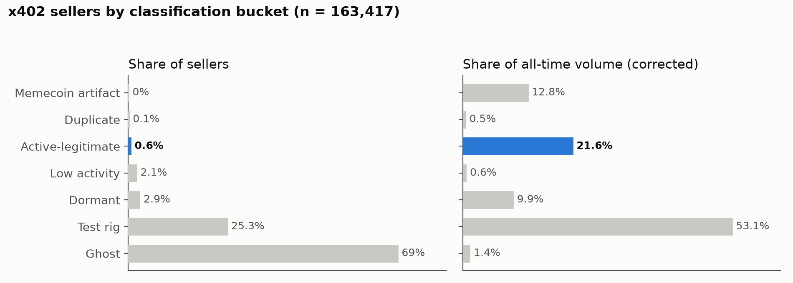
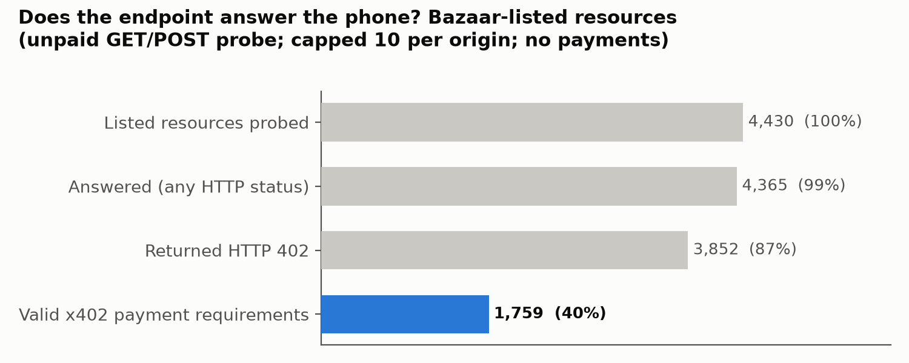
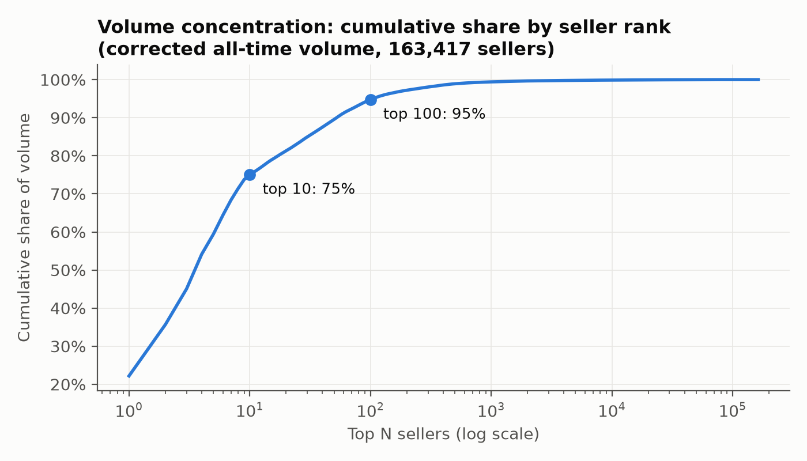
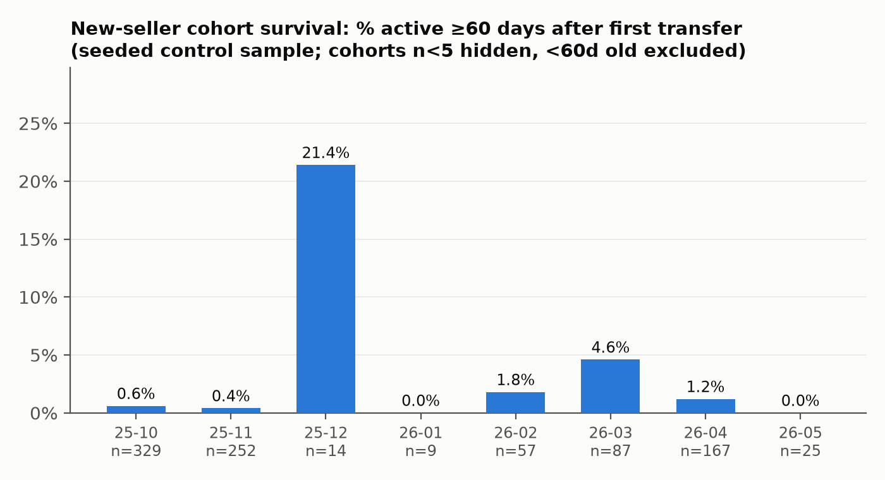

# The State of x402 Endpoints: How Much of the Seller Ecosystem Is Real?

**DRAFT — pending Phase 2.5 (paid delivery verification) results and final review.**

Data snapshot: 2026-07-03. Population: 163,417 sellers (receiving wallets) with
at least one facilitator-settled x402 transfer on Base or Solana, per the
x402scan index, verified against chain (§ Verification). Every number in this
document regenerates from `pipeline/run_all.sh` in this repository; every
threshold is a named value in `pipeline/config.yaml`.

## Findings

### 1. 0.58% of x402 sellers are active, legitimate services — but they carry 21.6% of volume

Of 163,417 sellers ever observed, **948 (0.58%)** survive all filters:
≥20 lifetime transactions, ≥5 distinct paying wallets (recomputed from
transfer-level data, not the indexer's aggregate field), and activity within
the last 30 days. Everything else is ghosts (69.0%), test rigs (25.3%),
dormant (2.9%), thin-recent (2.1%), URL-duplicates (0.13%), or memecoin
artifacts (0.04%).

| Bucket | Definition (config key) | Sellers | % sellers | % volume |
|---|---|---:|---:|---:|
| GHOST | <5 lifetime tx (`ghost`) | 112,694 | 68.96% | 1.4% |
| TEST_RIG | self-dealing ≥10% vol, or ≤2 payers, or top-2 payers ≥90% vol (`test_rig`) | 41,371 | 25.32% | 53.1% |
| DORMANT | real history, silent >60d (`dormant`) | 4,707 | 2.88% | 9.9% |
| LOW_ACTIVITY | recent, multi-payer, below sustained bar | 3,416 | 2.09% | 0.6% |
| ACTIVE_LEGITIMATE | sustained + diverse + recent (`active_legitimate`) | 948 | 0.58% | 21.6% |
| DUPLICATE | shares endpoint URL with a higher-volume wallet (`duplicate`) | 219 | 0.13% | 0.5% |
| MEMECOIN | mass identical small payments then silence (`memecoin`) | 62 | 0.04% | 12.8% |

Dormancy at all three windows (sellers with ≥5 lifetime tx, n=54,473):
**75.3% silent at 30 days, 49.6% at 60, 42.8% at 90.**

### 2. Only 26.9% of listed endpoints return a machine-payable x402 response

The catalogs overstate the network more than the chain does. Probing 6,551
listed URLs (unpaid GET, POST fallback for declared-POST routes, capped 10 per
origin, honest User-Agent):

- 87% of Bazaar-listed resources return HTTP 402 — but only **39.7% return a
  valid x402 body** (parseable `accepts` with scheme, network, payTo). The
  rest answer 402 with `{}` or ad-hoc error JSON that no buyer agent can pay
  against. Across all probed URLs (including registered origin roots) the
  valid-response rate is **26.9%**.
- 960 URLs (15%) return 200 — no payment gate at all; 857 return 404; 442
  fail at the network level.

### 3. The Bazaar's 22,954 listings collapse to 1,062 wallets — and to ~222 payable operators

The x402 Bazaar (Coinbase's discovery catalog) lists 22,954 resources. Those
listings resolve to **1,062 unique receiving wallets**; 5,683 resource URLs
appear under more than one wallet. **271 of the 1,062 wallets (25.5%) have
zero transfers in the activity index** — listed, never paid once. After
deduplicating to one payable endpoint per operator (per wallet/origin, Base
mainnet, ≤$1), the entire payable catalog is ~222 distinct operators.

### 4. Volume is extremely concentrated — and most of it is self-dealing

The top 10 sellers carry **75.1%** of all-time corrected volume; the top 100
carry **94.8%**. Within ACTIVE_LEGITIMATE, the top 10 carry 93.8% of that
bucket's volume. Concentration and wash-patterns overlap: the single largest
seller by volume shows **87% of its volume paid from its own wallet**, and 4
of the top 8 are TEST_RIG (self-pay 52–95%).

### 5. New-seller survival is near zero

Of sellers first seen in Oct 2025 (the memecoin/registration wave; n=329 in
the control sample), **0.6% had any activity 60 days later**. Post-wave
cohorts run 0–5%. (Control-sample estimate; per-cohort n on the chart.)

### 6. The index itself is accurate — but its seller aggregates were inflated ~3×, which we corrected

Two verification results that cut in opposite directions:

- **The transfer-level index is accurate.** For 40 seeded-random sellers, all
  153 index-claimed transfers exist on Base with matching recipients (100%
  match; 4 apparent misses were Blockscout listing gaps, recovered by direct
  RPC receipt checks). Solana: 120/126 signatures found via public RPC.
- **The seller-level aggregates were inflated.** x402scan's seller list view
  multiplies each seller's tx_count, volume, and buyer count by the number of
  facilitators that ever settled for them (a `LATERAL unnest` before `SUM` in
  the view query). Validated against complete transfer histories: sellers
  with 2/3/4 facilitators show ratios of exactly 2.0/3.0/4.0. Corrected,
  the ecosystem's all-time volume is **$51.9M, not the $154.8M** the raw
  view reports. All numbers in this report use corrected values
  (`data/processed/census_inflation_validation.json`).

## Methodology

**Sources.** (1) x402scan public tRPC API — seller census (163,417 wallets,
drift-free recipient-keyed pagination), per-seller transfer histories, origin→
wallet map; (2) Coinbase CDP Bazaar discovery API — 22,954 listings; (3) Base
via Blockscout REST + public RPC, Solana public RPC — verification. All pulls
raw-archived (`data/raw/`, gzip, never overwritten) with an append-only
request log (~12k requests: timestamp, URL, params, status, response hash).

**Classification.** Two passes. Census pass: every seller bucketed on
corrected aggregates. Deep pass: transfer-level features for 3,523 sellers —
top-1,000 by corrected volume (exhaustive), all 1,173 ACTIVE_LEGITIMATE
candidates, and a 1,500-seller seeded random control (seed 402402). Features:
recomputed unique payers, self-pay share, top-2 payer concentration, modal
amount share, burst/span/silence. Bucket priority: GHOST > TEST_RIG >
DUPLICATE > MEMECOIN > DORMANT > ACTIVE_LEGITIMATE.

**Classifier error, measured.** On the control sample the census-level
classifier agrees with the deep-signal classifier for **98.9%** of sellers.
Errors are one-directional: 19% of census-DORMANT controls reclassify to
TEST_RIG/MEMECOIN under transfer-level signals; census-TEST_RIG was confirmed
333/333. Corrected population shares (transition rates applied to non-deep-
pulled sellers only) change no headline by more than 0.3 points.

**Hand inspection.** 5 seeded-random sellers per bucket eyeballed against
their definitions: 33/35 outright matches; the 2 exceptions are census-only
sellers whose patterns look rig-like — the exact direction the control
quantifies (`analysis/hand_inspection.md`).

**Buyer counts recomputed.** All diversity claims use payer wallets deduped
across chains from raw transfers. The indexer's aggregate buyer field, after
facilitator correction, matches recomputed counts for 93.9% of complete-
history sellers (median ratio 1.00).

**Liveness.** 6,551 URLs, unpaid probes only, ≤4 req/s global, ≥5s per host,
identifying User-Agent, 15s timeout. Valid-402 = parseable accepts with
scheme + network + payTo.

## Limitations

1. **On-chain activity proves payments, not service quality.** A seller with
   real, diverse, recent payments could still return garbage — payment
   activity is our ceiling on "legitimate," not proof of delivery. (Phase 2.5
   paid-probe pilot addresses this on a 75-endpoint sample.)
2. **Facilitator-scoped visibility.** All sources observe facilitator-settled
   transfers for ~30 known facilitators on Base + Solana. x402 payments
   settled directly (seller as its own facilitator) are invisible here. The
   25.5% of listed wallets with zero indexed activity is partly this, partly
   truly-never-used; we cannot split the two from the data.
3. **Thresholds are judgment calls.** Every one is a named value in
   `pipeline/config.yaml`; disagree, edit, re-run `pipeline/run_all.sh`. The
   headline is threshold-robust in the directions we tested (top-8 TEST_RIG
   sellers sit 5–9× above the self-pay line).
4. **Deep signals cover 3,523 of 163,417 sellers** (all candidates + top
   volume + control); the rest carry census-level buckets with the measured
   1.1% error rate and known under-detection of rigs inside DORMANT.
5. **Sample-based cohort survival.** Cohort estimates come from the 1,500-
   seller control; small post-wave cohorts have wide intervals (n on chart).
6. **Index dependence.** The transfer index passed a 40-seller/153-tx
   on-chain audit and we corrected its seller-aggregate inflation, but any
   unknown index-level gap propagates. Solana verification is weaker (public
   RPC history retention).
7. **Timing.** All numbers are as of 2026-07-03; the census is all-time, so
   the wave-then-silence dynamics of late 2025 dominate lifetime aggregates.

---

*Repository layout: `pipeline/` (collection + classification, config),
`analysis/` (every figure's script + JSON output), `data/raw/` (immutable
pulls + request log), `data/processed/` (derived tables), `report/figs/`
(chart PNGs + `analysis/make_charts.py`).*
